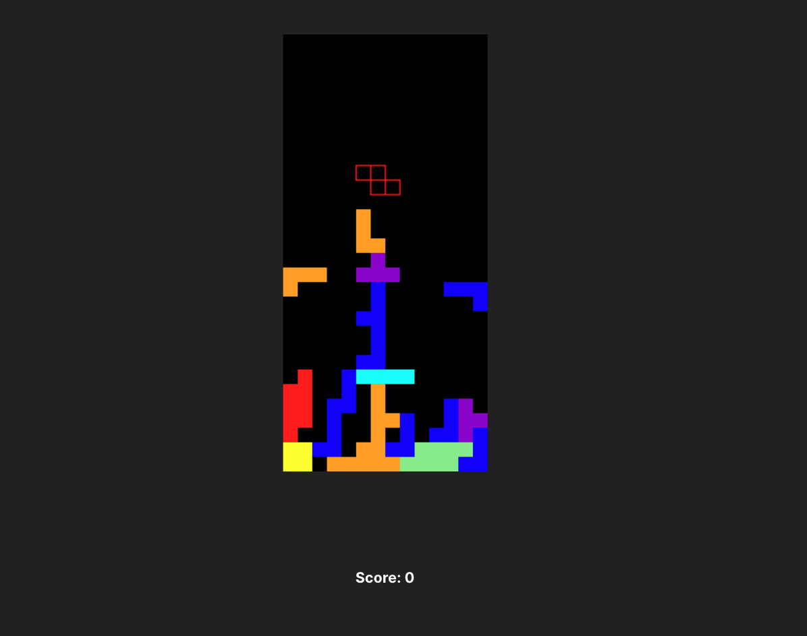

# Tetris with TypeScript

Done for educational purposes. Deploy [here](https://tetris-ts.vercel.app/)

Welcome to a modern take on the classic Tetris game. This project is a fully functional Tetris game that includes features such as a game loop that updates the game state, a player piece that can be moved and rotated, collision detection, and score updating. The game is built with a focus on clean, efficient code and a user-friendly interface. The game board is dynamically created and rendered on a canvas element, and the game state is constantly updated and displayed to the player.

## Known issues

- [ ] Fix the collision in the lateral parts
- [ ] Store max. score in local storage
- [ ] Show speed in screen and increase it every 50 points
- [ ] Change background depending on amount of points and speed?
